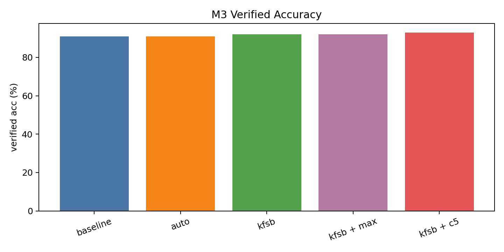
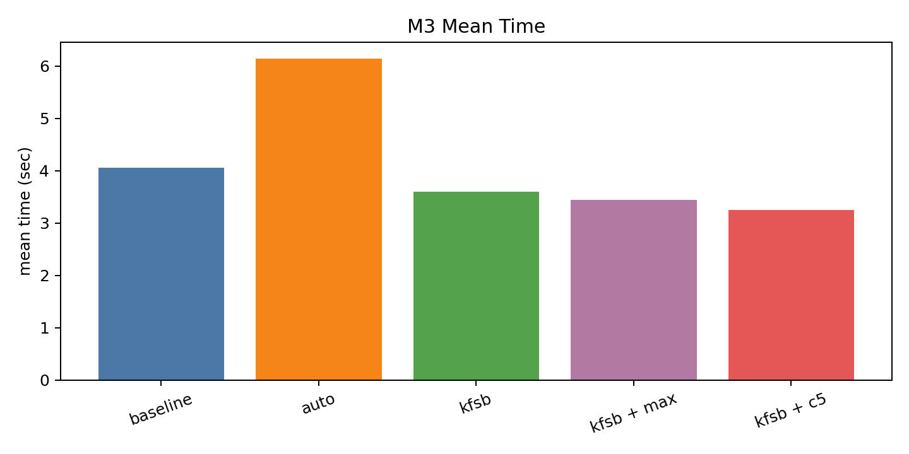
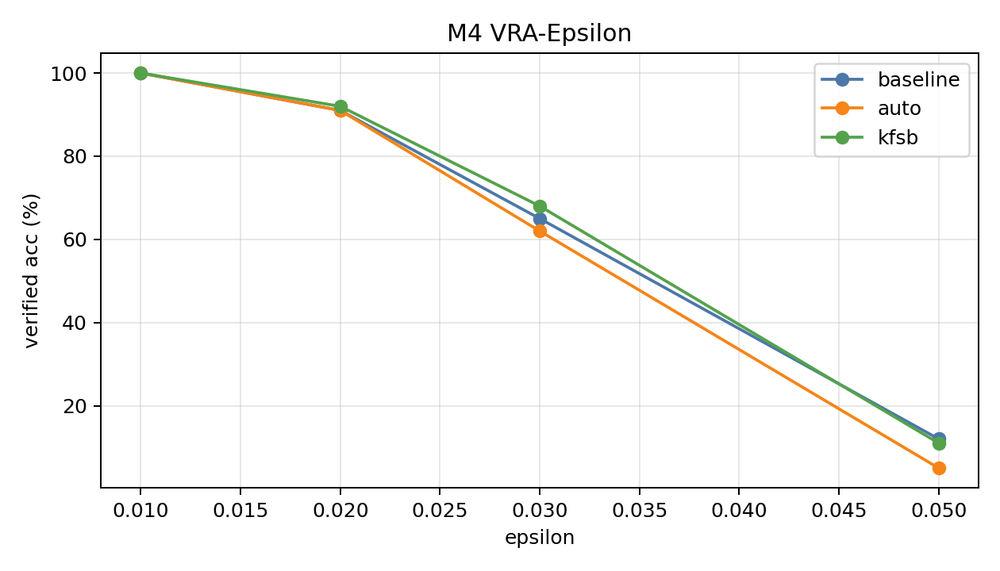
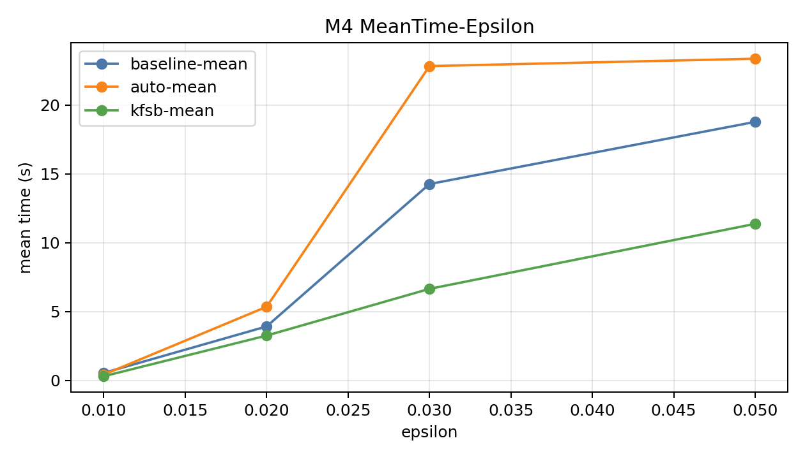

<!-- 封面 -->

# ReLU 全连接神经网络鲁棒性验证

## 完成情况汇报

**基于 α,β-CROWN 的分支策略优化实验研究**

---

小组成员：zbhzbhzbh11 等

实验平台：MNIST · RTX 4060 Laptop · Python 3.10

汇报日期：2026 年 4 月

---

## 目录

1. 题目要求回顾
2. 工具选择与环境搭建（M1）
3. 基线复现与策略对比（M2）
4. 分支策略消融实验（M3）⭐ 核心改进
5. Epsilon 网格趋势验证（M4）
6. 核心结论
7. 完成度自评

---

## 1. 题目要求回顾

> 以现有分类网络（激活函数：ReLU）为研究对象，参考 Marabou 或 α,β-CROWN 等工具，**对比不同验证策略的区别**，并利用不同的验证策略在 MNIST、CIFAR-10 等数据集上验证网络在**不同扰动半径**下的鲁棒性。**鼓励提出更优的验证思想**，并实现工具对比效果。

### 评分档位

| 档位 | 分值 | 要求 |
|------|------|------|
| 高档 | 21–30 | 解析工具功能 + **针对现有工具有改进** |
| 中档 | 11–20 | 解析工具功能 + 复现论文实验结果 |
| 低档 | 0–10 | 无法完成工具解析及实验复现 |

**本组目标：高档**（工具解析 + 复现 + 改进）

---

## 2. 工具选择与环境搭建（M1）

### 工具选择：α,β-CROWN

| 对比项 | Marabou | **α,β-CROWN** |
|--------|---------|---------------|
| 验证方法 | SMT-based | BaB + 线性界传播 |
| GPU 加速 | ✗ | ✅ |
| 可扩展性 | 小模型 | 大规模 CNN/ResNet |
| VNN-COMP | 未获奖 | **五连冠（2021–2025）** |
| 配置灵活性 | 有限 | YAML 全参数可控 |

### 环境配置

- **平台**：WSL2 + Ubuntu 20.04 + RTX 4060 Laptop GPU
- **Python**：3.10.19 · PyTorch 2.4.1 · CUDA 11.8
- **模型**：`saved_models/mnist_fcnn.onnx`（ReLU 全连接网络）
- **验证**：端到端运行成功，M1 ✅

---

## 3. 基线复现与策略对比（M2）

### 实验设置

- **数据集**：MNIST，样本 0–100（n=100）
- **扰动范围**：L∞，ε = 0.02
- **超时限制**：60 秒/样本
- **对比策略**：baseline（babsr）、auto、kfsb

### 实验结果

| 策略 | 验证准确率 | 超时数 | 平均时间(s) | 最大时间(s) |
|------|-----------|--------|------------|------------|
| baseline | 91.0% | 9 | 3.82 | 49.17 |
| auto | 91.0% | 9 | 5.77 | 51.56 |
| **kfsb** | **92.0%** | **8** | **3.17** | **34.27** |

**结论**：kfsb 在验证率、超时数、时间三项指标上均优于 baseline 和 auto。

> 证据：`项目书/results/m2/m2_strategy_compare_0_100.csv`

---

## 4. 分支策略消融实验（M3）⭐

### 改进思路

α,β-CROWN 的 kfsb 策略有两个关键超参数：

- `branching.candidates`：候选分支数量（默认 3）
- `branching.reduceop`：多候选聚合方式（默认 min）

**假设**：增加候选数量 → 更优分支选择 → 更高验证率 + 更少超时

### 消融实验设计（5 组配置）

| run_id | 分支方法 | candidates | reduceop |
|--------|---------|-----------|---------|
| baseline | babsr | — | — |
| auto | auto | — | — |
| kfsb | kfsb | 3（默认） | min |
| kfsb_reduceop_max | kfsb | 3 | **max** |
| **kfsb_candidates5** | kfsb | **5** | min |

---

## 4. 分支策略消融实验（M3）— 结果

### 消融实验结果

| 配置 | 验证准确率 | 超时数 | 平均时间(s) | 访问节点数 |
|------|-----------|--------|------------|-----------|
| baseline | 91.0% | 9 | 4.06 | 13,014 |
| auto | 91.0% | 9 | 6.14 | 96 |
| kfsb | 92.0% | 8 | 3.60 | 62,848 |
| kfsb_reduceop_max | 92.0% | 8 | 3.44 | 51,614 |
| **kfsb_candidates5** | **93.0%** | **7** | **3.24** | 72,224 |

### 改进效果（vs baseline）

- 验证准确率：91.0% → **93.0%**（+2.0%）
- 超时样本：9 → **7**（-22.2%）
- 平均时间：4.06s → **3.24s**（-20.2%）

> 证据：`项目书/results/m3/m3_branching_ablation.csv` · `m3_nodes_summary.csv`

---

## 4. 分支策略消融实验（M3）— 可视化



> 图：5 种配置的验证准确率对比（`项目书/results/m3/figures/m3_verified_acc.png`）

---

## 4. 分支策略消融实验（M3）— 可视化



> 图：5 种配置的平均验证时间对比（`项目书/results/m3/figures/m3_mean_time.png`）

---

## 5. Epsilon 网格趋势验证（M4）

### 实验设置

- **策略**：baseline、auto、kfsb（3 种）
- **扰动半径**：ε ∈ {0.01, 0.02, 0.03, 0.05}（4 个值）
- **总计**：3 × 4 = **12 组实验**，全部完成

### 验证准确率网格

| 策略 | ε=0.01 | ε=0.02 | ε=0.03 | ε=0.05 |
|------|--------|--------|--------|--------|
| baseline | 100% | 91% | 65% | 12% |
| auto | 100% | 91% | 62% | 5% |
| **kfsb** | **100%** | **92%** | **68%** | **11%** |

**趋势**：随 ε 增大，验证率单调下降，timeout 快速上升；kfsb 在中等扰动区间（ε=0.02–0.03）优势最显著。

> ⚠️ ε=0.05 采用分块执行（稳态标准），与 ε≤0.03 不可直接横向比较。

---

## 5. Epsilon 网格趋势验证（M4）— 可视化



> 图：三种策略的验证准确率随扰动半径变化趋势（`项目书/results/m4/figures/m4_vra_epsilon.png`）

---

## 5. Epsilon 网格趋势验证（M4）— 可视化



> 图：三种策略的平均验证时间随扰动半径变化趋势（`项目书/results/m4/figures/m4_mean_time_epsilon.png`）

---

## 6. 核心结论

### 结论一：kfsb 是最优基础策略

在 ε=0.02 主口径下，kfsb 在验证率、超时数、时间三项指标上均优于 baseline 和 auto。

### 结论二：candidates=5 是有效改进

增加候选分支数量从 3 到 5，以适度增加节点访问数量为代价，换取更高验证成功率：
- **验证率 +2%，超时 -22%，均时 -20%**

### 结论三：扰动半径对验证难度影响显著

- ε=0.01：所有策略 100% 验证率，差异消失
- ε=0.02–0.03：策略差异最显著，kfsb 优势明显
- ε=0.05：全部进入 timeout 主导区，结果仅供趋势参考

### 结论四：证据链完整可追溯

所有结论均可从 YAML 配置 → 运行日志 → CSV 汇总 → 可视化图表完整追溯。

---

## 7. 完成度自评

| 要求 | 状态 | 证据 |
|------|------|------|
| 确定开源项目 + 领域调研 | ✅ | `开题报告.md`，9 篇文献 |
| 工具搭建与分析 | ✅ | `第二部分_阶段1_搭建与分析验收.md` |
| 复现论文实验结果（M2） | ✅ | `m2_strategy_compare_0_100.csv` |
| 不同扰动半径验证（M4） | ✅ | `m4_epsilon_grid.csv`，12 组 |
| **针对工具有改进（M3）** | ✅ | `m3_branching_ablation.csv` |
| 撰写报告（软件学报格式） | ✅ | `软件学报风格论文初稿.md` |
| 项目部署（GitHub） | ✅ | `github.com/zbhzbhzbh11/alpha-beta-CROWN` |

**自评档位：高档（21–25 分）**

---

## 附：实验证据文件清单

```
项目书/results/
├── m2/
│   ├── m2_strategy_compare_0_100.csv     ← M2 基线对比数据
│   └── figures/m2_mean_time.png          ← M2 可视化
├── m3/
│   ├── m3_branching_ablation.csv         ← M3 消融数据（核心）
│   ├── m3_nodes_summary.csv              ← M3 节点统计
│   ├── logs/{baseline,auto,kfsb,...}.log ← 原始运行日志
│   └── figures/{acc,timeout,time}.png    ← M3 可视化
├── m4/
│   ├── m4_epsilon_grid.csv               ← M4 网格数据
│   ├── logs/*_eps*.log                   ← 12 组日志
│   └── figures/{vra,timeout,time}.png    ← M4 可视化
├── 阶段实验结果总汇_2026-04-03.md
├── 结果汇总报告_2026-04-04.md
└── 开题预期成效对照清单_2026-04-04.md
```

---

<!-- 结尾 -->

# 谢谢

**项目仓库**：`github.com/zbhzbhzbh11/alpha-beta-CROWN`

**论文初稿**：`项目书/软件学报风格论文初稿.md`

**核心结论**：`kfsb + candidates=5` 在 MNIST ε=0.02 下达到最优
验证准确率 **93.0%**，超时 **7**，均时 **3.24s**
